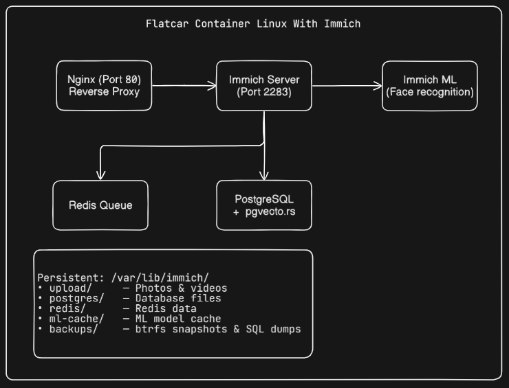

# Flatcar App: Immich

> **Self-hosted photo and video backup solution on [Flatcar Container Linux](https://www.flatcar.org/)**

> Deploy [Immich](https://immich.app/). The open-source Google Photos alternative on an immutable, auto-updating OS.

> **Work in Progress** — This project is actively being developed and tested. New features, deployment guides, and improvements are coming soon. Stay tuned for updates!
---

## Overview

This repository provides a complete, production-ready reference implementation for running **Immich** on **Flatcar Container Linux**. It demonstrates:

- **Declarative provisioning** with Butane → Ignition
- **Multi-container orchestration** using systemd + Docker
- **Persistent data management** that survives OS updates
- **Automated backups** with btrfs snapshots
- **Health monitoring** and operational tooling
- **Reverse proxy** with Nginx

## Architecture



## Quick Start

### 1. Prerequisites

- [Butane](https://coreos.github.io/butane/getting-started/) installed
- A target environment: [QEMU](#qemu), [AWS](#aws), or [Bare Metal](#bare-metal)

### 2. Configure

Edit `butane/immich.bu` and replace the SSH key:

```yaml
passwd:
  users:
    - name: core
      ssh_authorized_keys:
        - ssh-ed25519 AAAAC3NzaC... YOUR_KEY_HERE
```

### 3. Generate Ignition

```bash
butane --strict butane/immich.bu > ignition/immich.ign
```

### 4. Deploy

See platform-specific guides:
- [QEMU (local testing)](docs/qemu.md)
- [AWS EC2](docs/aws.md)
- [Bare Metal](docs/bare-metal.md)

### 5. Access Immich

Once deployed, open `http://<flatcar-ip>` in your browser and create your admin account.

## What's Included

| Component | Description |
|-----------|-------------|
| **Immich Server** | Main API & web UI (port 2283) |
| **Immich ML** | CPU-based machine learning for face recognition & search |
| **PostgreSQL** | Database with `pgvecto.rs` extension for semantic search |
| **Redis** | Job queue and caching |
| **Nginx** | Reverse proxy on port 80 with 50GB upload limit |
| **Backup System** | Daily automated btrfs snapshots + SQL dumps |
| **Health Checks** | Container health checks + `immich-health` command |

## Flatcar-Specific Design Decisions

### Immutable OS + Container Updates

Flatcar handles OS updates automatically. Container images are pulled fresh on service restart:

```systemd
ExecStartPre=/usr/bin/docker pull ghcr.io/immich-app/immich-server:release
```

To update containers: `make update-containers` or run `scripts/update-containers.sh`.

### Persistent Storage

All data lives under `/var/lib/immich/`, which is on the stateful partition. This survives:
- Reboots
- OS updates (Flatcar's A/B partition scheme)
- Container restarts

### Service Dependencies

systemd ensures correct startup order:

```
immich-network → immich-postgres + immich-redis + immich-ml → immich-server → immich-proxy
```

### Backup Strategy

The included backup script creates:
1. **btrfs snapshots** for instant point-in-time recovery
2. **PostgreSQL dumps** for portability

Backups run daily via systemd timer and keep 7 days of history.

## Operational Commands

```bash
# Check health of all components
immich-health

# View service logs
journalctl -u immich-server -f

# Manual backup
sudo immich-backup

# Restore from backup
sudo scripts/restore.sh immich_backup_20240115_030000

# Update all containers
sudo scripts/update-containers.sh

# Restart all services
sudo systemctl restart immich-*

# Check backup timer
systemctl list-timers immich-backup.timer
```

## Security Considerations

- **SSH key only** — password auth is disabled
- **Container isolation** — each service runs in its own container
- **SELinux labels** — volumes use `:Z` for proper labeling
- **No root containers** — services run as non-root where possible
- **Database password** — change the default `postgres` password in production


## Customization

### Change Upload Location

Edit `butane/immich.bu`:

```yaml
storage:
  directories:
    - path: /mnt/bigdisk/immich/upload
      mode: 0755
```

And update the volume mount in the `immich-server` service.

### Use External Database

Replace the local PostgreSQL service with connection details to an external DB:

```yaml
# In immich-server service, change:
--env DB_HOSTNAME=your-rds-instance.amazonaws.com
--env DB_PASSWORD=your-secure-password
```

## Troubleshooting

| Issue | Solution |
|-------|----------|
| `Connection refused` on port 2283 | Wait 2-3 minutes for first boot; check `systemctl status immich-server` |
| Out of disk space | Photos are in `/var/lib/immich/upload`; expand the data partition |
| Containers not starting | Check `journalctl -u docker -f` and `docker logs <container>` |
| Backup failures | Ensure `/var/lib/immich` is on a btrfs filesystem |
| Slow ML operations | Increase RAM or add GPU passthrough |

---

> Built with ❤️ for the Flatcar community. This is a reference implementation adapt it to your needs.
